# Basic E-Commerce App

## Introduction:

    Let me give you a brief overview of the project, 
    Contain an Auth methode (Login - Signup)  also profile screen to edit the user profile.
    there is anther 4 screen: Home screen to show Best selling from products  in addition to  product and categories also search bar,
    and as a second screen is a category screen to show the categories,
    also The Favoriets Screen to show the product what the user like it,
    Finally, The setting screen.

## This Project Created use :
        - Sign-In, Sign-Up and Log_out using Email & Password .
        - Categories and Search for Products.
        - Add/Remove Products to/from favoriets.
        - Edit your account information and upload image at Profile section.
        - Check your Favorites History.
        - Using Responsive UI.
        - Using Api (DIO), Sheard prefrence.
        - Using Cubit as state management.
        - Using MVC as Architect Design.

## ScreenShots
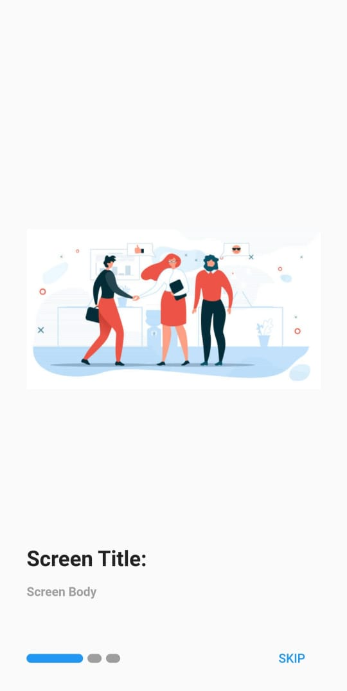
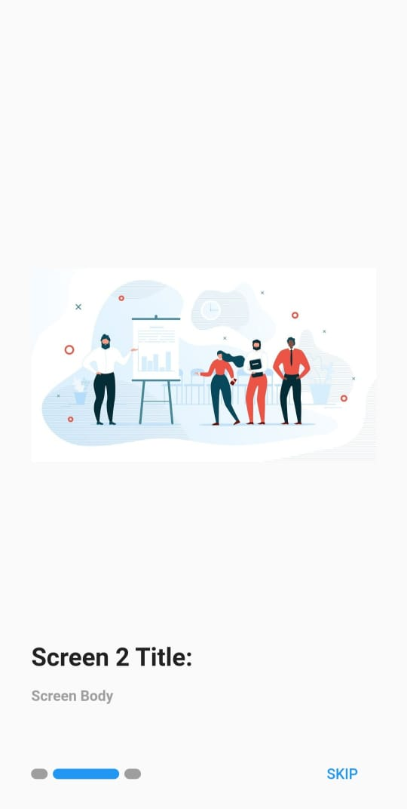
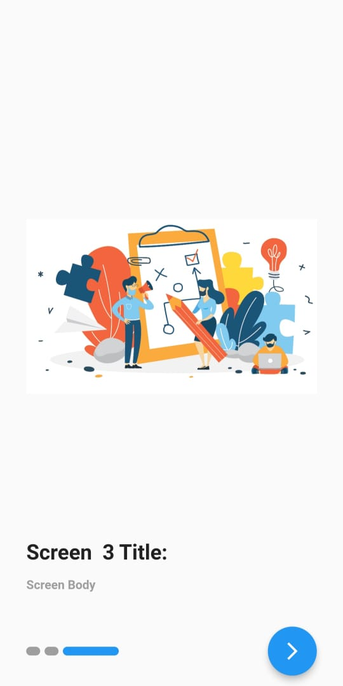
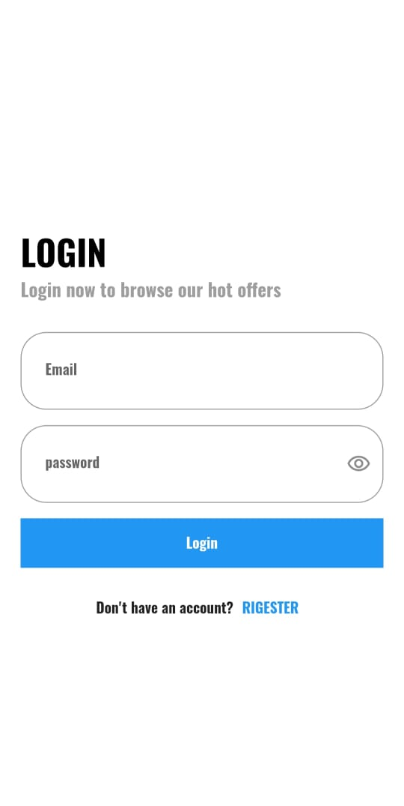
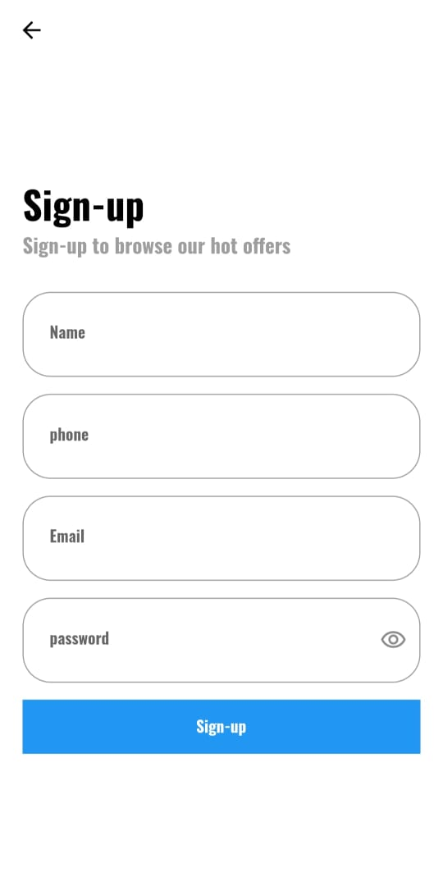
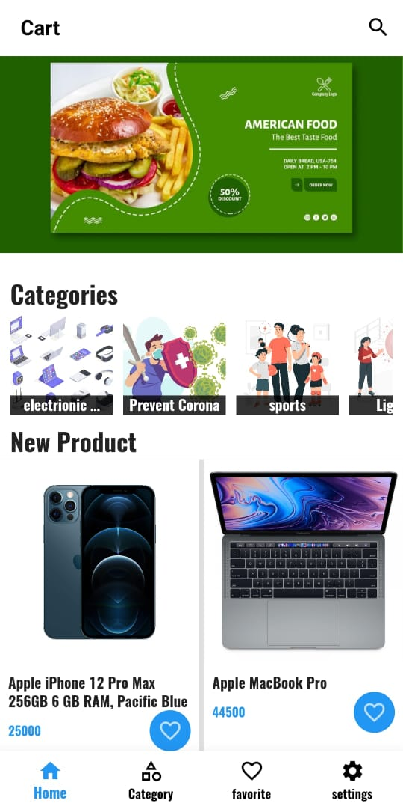
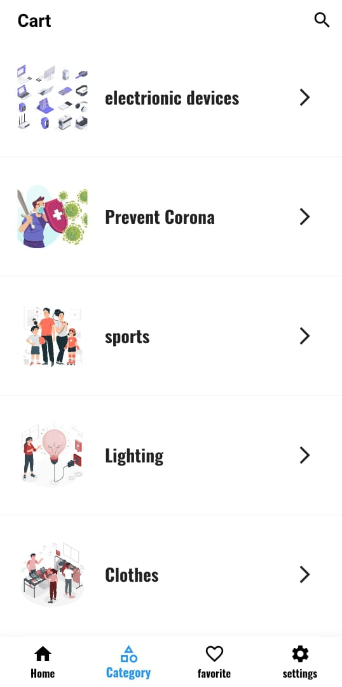
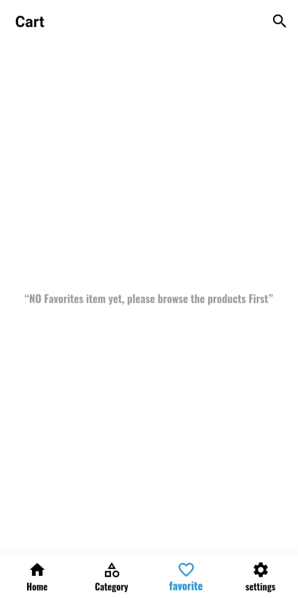
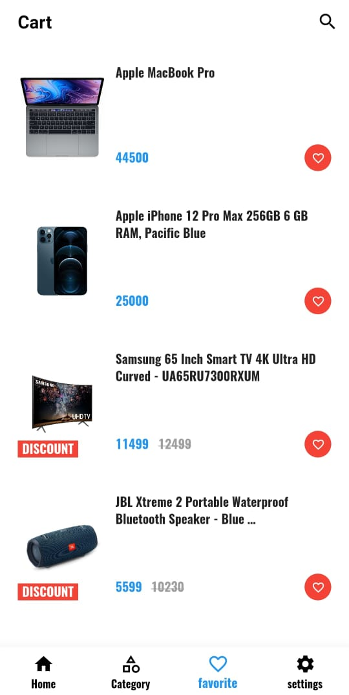
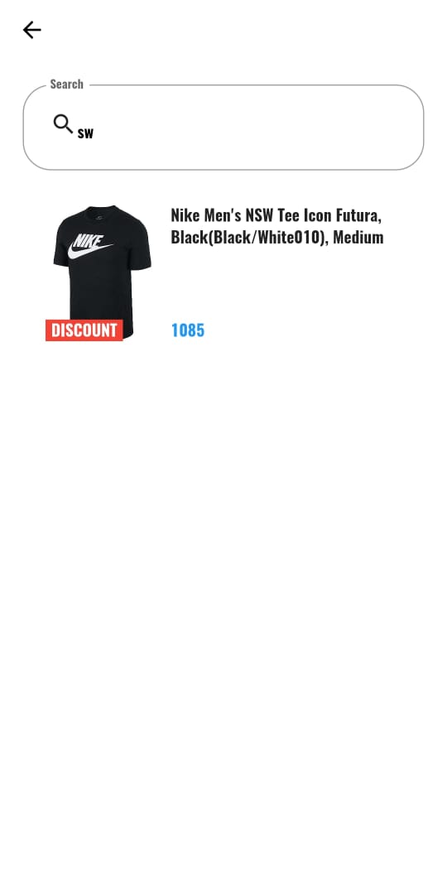
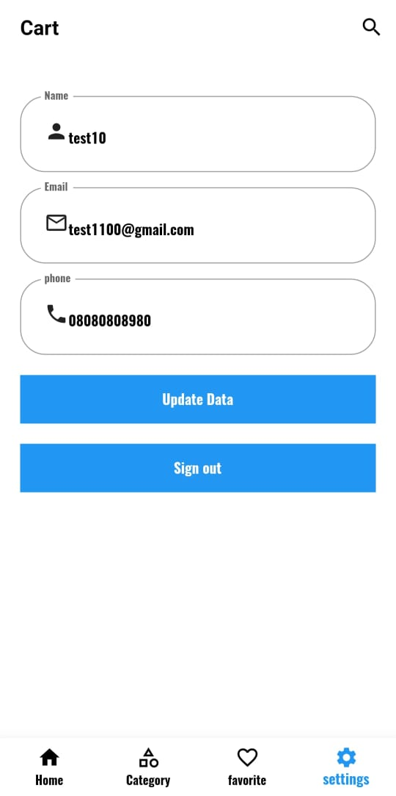
